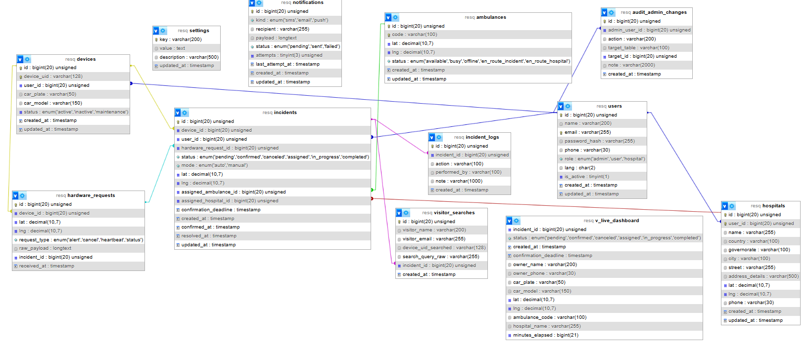

# **ResQ — Full Database Documentation**

---

# **1. Overview**

The **ResQ Database** powers the complete workflow of detecting vehicle accidents, validating alerts, assigning ambulances, selecting hospitals, and displaying the entire flow on real‑time dashboards.

This documentation describes **all database tables**, **relationships**, **views**, **stored procedures**, and **data logic rules**, structured for production use.

**Important Note:**
Ambulance movement is **simulated**, not tracked by hardware. Therefore, **no telemetry history table is required**. Only the latest ambulance location is stored.

---

# **2. Technology Requirements**

The ResQ system strictly uses:

* **MySQL** (InnoDB, utf8mb4)
* **Node.js + Express** backend
* **Socket.io** for real‑time updates
* **HTML + TailwindCSS + Vanilla JS** frontend

Character Set:

```
utf8mb4 / utf8mb4_general_ci
```

Supports full **English + Arabic** data.

---

# **3. Entity Relationship Summary**

```
users 1 ────∞ devices
users 1 ────∞ incidents
hospitals 1 ────∞ incidents
ambulances 1 ────∞ incidents

devices 1 ────∞ hardware_requests
devices 1 ────∞ incidents

incidents 1 ────∞ incident_logs
visitor_searches 0/1 ──── 1 incidents (optional)

settings, notifications, audit_admin_changes are standalone support tables.
```
## Database ER Diagram


]

---

# **4. Tables Documentation**

Each table includes: purpose, fields, field types, and descriptions.

---

## **4.1 users**

**Purpose:** Stores all system accounts: Admin, Hospital, and Vehicle Owners.

### **Fields**

| Column        | Type                            | Description                    |
| ------------- | ------------------------------- | ------------------------------ |
| id            | BIGINT UNSIGNED                 | Primary key                    |
| name          | VARCHAR(200)                    | Full name                      |
| email         | VARCHAR(255) UNIQUE             | Login credential               |
| password_hash | VARCHAR(255)                    | Hashed password                |
| phone         | VARCHAR(30)                     | Contact number                 |
| role          | ENUM('admin','user','hospital') | Account type                   |
| lang          | CHAR(2)                         | Preferred language ('en','ar') |
| is_active     | TINYINT(1)                      | Account status                 |
| created_at    | TIMESTAMP                       | Creation timestamp             |
| updated_at    | TIMESTAMP                       | Last update timestamp          |

---

## **4.2 devices**

**Purpose:** Represents hardware installed inside vehicles.

### **Fields**

| Column     | Type                                    | Description           |
| ---------- | --------------------------------------- | --------------------- |
| id         | BIGINT UNSIGNED                         | Primary key           |
| device_uid | VARCHAR(128) UNIQUE                     | Unique hardware ID    |
| user_id    | BIGINT UNSIGNED                         | FK → users(id)        |
| car_plate  | VARCHAR(50)                             | Vehicle plate         |
| car_model  | VARCHAR(150)                            | Vehicle model         |
| status     | ENUM('active','inactive','maintenance') | Device status         |
| created_at | TIMESTAMP                               | Creation timestamp    |
| updated_at | TIMESTAMP                               | Last update timestamp |

---

## **4.3 hospitals**

**Purpose:** Stores hospital data and location.

### **Fields**

| Column          | Type                   | Description           |
| --------------- | ---------------------- | --------------------- |
| id              | BIGINT UNSIGNED        | Primary key           |
| user_id         | BIGINT UNSIGNED UNIQUE | FK → users(id)        |
| name            | VARCHAR(255)           | Hospital name         |
| country         | VARCHAR(100)           | Country               |
| governorate     | VARCHAR(100)           | Governorate           |
| city            | VARCHAR(100)           | City                  |
| street          | VARCHAR(255)           | Street                |
| address_details | VARCHAR(500)           | Extra address info    |
| lat             | DECIMAL(10,7)          | Latitude              |
| lng             | DECIMAL(10,7)          | Longitude             |
| phone           | VARCHAR(30)            | Contact number        |
| created_at      | TIMESTAMP              | Creation timestamp    |
| updated_at      | TIMESTAMP              | Last update timestamp |

---

## **4.4 ambulances**

**Purpose:** Stores ambulance units and their latest known location.

### **Fields**

| Column     | Type                                                                       | Description           |
| ---------- | -------------------------------------------------------------------------- | --------------------- |
| id         | BIGINT UNSIGNED                                                            | Primary key           |
| code       | VARCHAR(100) UNIQUE                                                        | Ambulance code        |
| lat        | DECIMAL(10,7)                                                              | Latest latitude       |
| lng        | DECIMAL(10,7)                                                              | Latest longitude      |
| status     | ENUM('available','busy','offline','en_route_incident','en_route_hospital') | Current status        |
| created_at | TIMESTAMP                                                                  | Creation timestamp    |
| updated_at | TIMESTAMP                                                                  | Last update timestamp |

---

## **4.5 hardware_requests**

**Purpose:** Stores all raw JSON data sent by the hardware device.

### **Fields**

| Column       | Type                                        | Description                         |
| ------------ | ------------------------------------------- | ----------------------------------- |
| id           | BIGINT UNSIGNED                             | Primary key                         |
| device_id    | BIGINT UNSIGNED                             | FK → devices(id)                    |
| lat          | DECIMAL(10,7)                               | Latitude reported by device         |
| lng          | DECIMAL(10,7)                               | Longitude reported by device        |
| request_type | ENUM('alert','cancel','heartbeat','status') | Request category                    |
| raw_payload  | JSON                                        | Full raw data from hardware         |
| incident_id  | BIGINT UNSIGNED NULL                        | Optional FK → incidents(id)         |
| received_at  | TIMESTAMP                                   | When the server received the packet |

---

## **4.6 incidents**

**Purpose:** Represents an accident case.

### **Fields**

| Column                | Type                                                                        | Description                          |
| --------------------- | --------------------------------------------------------------------------- | ------------------------------------ |
| id                    | BIGINT UNSIGNED                                                             | Primary key                          |
| device_id             | BIGINT UNSIGNED                                                             | FK → devices(id)                     |
| user_id               | BIGINT UNSIGNED NULL                                                        | FK → users(id)                       |
| hardware_request_id   | BIGINT UNSIGNED NULL                                                        | FK → hardware_requests(id)           |
| status                | ENUM('pending','confirmed','canceled','assigned','in_progress','completed') | Current status                       |
| mode                  | ENUM('auto','manual')                                                       | Incident creation mode               |
| lat                   | DECIMAL(10,7)                                                               | Latitude of incident                 |
| lng                   | DECIMAL(10,7)                                                               | Longitude of incident                |
| assigned_ambulance_id | BIGINT UNSIGNED NULL                                                        | FK → ambulances(id)                  |
| assigned_hospital_id  | BIGINT UNSIGNED NULL                                                        | FK → hospitals(id)                   |
| confirmation_deadline | TIMESTAMP                                                                   | End of 10-second confirmation window |
| created_at            | TIMESTAMP                                                                   | Creation timestamp                   |
| confirmed_at          | TIMESTAMP NULL                                                              | When confirmed                       |
| resolved_at           | TIMESTAMP NULL                                                              | When resolved/closed                 |
| updated_at            | TIMESTAMP                                                                   | Last update timestamp                |

---

## **4.7 incident_logs**

**Purpose:** Tracks all changes/events related to an incident.

### **Fields**

| Column       | Type            | Description                      |
| ------------ | --------------- | -------------------------------- |
| id           | BIGINT UNSIGNED | Primary key                      |
| incident_id  | BIGINT UNSIGNED | FK → incidents(id)               |
| action       | VARCHAR(100)    | Action performed                 |
| performed_by | VARCHAR(100)    | System/admin/hardware identifier |
| note         | VARCHAR(1000)   | Extra details                    |
| created_at   | TIMESTAMP       | Log timestamp                    |

---

## **4.8 visitor_searches**

**Purpose:** Logs public search attempts by visitors.

### **Fields**

| Column              | Type                 | Description                 |
| ------------------- | -------------------- | --------------------------- |
| id                  | BIGINT UNSIGNED      | Primary key                 |
| visitor_name        | VARCHAR(200)         | Name of visitor             |
| visitor_email       | VARCHAR(255)         | Email of visitor            |
| device_uid_searched | VARCHAR(128)         | Device UID entered          |
| search_query_raw    | VARCHAR(255)         | Original query text         |
| incident_id         | BIGINT UNSIGNED NULL | Optional FK → incidents(id) |
| created_at          | TIMESTAMP            | Timestamp                   |

---

## **4.9 notifications**

**Purpose:** Queue for outbound SMS/Email/Push notifications.

### **Fields**

| Column          | Type                            | Description            |
| --------------- | ------------------------------- | ---------------------- |
| id              | BIGINT UNSIGNED                 | Primary key            |
| kind            | ENUM('sms','email','push')      | Notification type      |
| recipient       | VARCHAR(255)                    | Target phone/email     |
| payload         | JSON                            | Notification content   |
| status          | ENUM('pending','sent','failed') | Delivery state         |
| attempts        | TINYINT UNSIGNED                | Retry attempts         |
| last_attempt_at | TIMESTAMP NULL                  | Last attempt timestamp |
| created_at      | TIMESTAMP                       | Creation timestamp     |
| updated_at      | TIMESTAMP                       | Update timestamp       |

---

## **4.10 settings**

**Purpose:** Key/value configuration storage.

### **Fields**

| Column      | Type                     | Description                 |
| ----------- | ------------------------ | --------------------------- |
| key         | VARCHAR(200) PRIMARY KEY | Setting identifier          |
| value       | TEXT                     | Setting value (string/JSON) |
| description | VARCHAR(500)             | Description                 |
| updated_at  | TIMESTAMP                | Last modified               |

---

## **4.11 audit_admin_changes**

**Purpose:** Tracks admin-level sensitive system operations.

### **Fields**

| Column        | Type                 | Description               |
| ------------- | -------------------- | ------------------------- |
| id            | BIGINT UNSIGNED      | Primary key               |
| admin_user_id | BIGINT UNSIGNED NULL | FK → users(id)            |
| action        | VARCHAR(200)         | What action was performed |
| target_table  | VARCHAR(100)         | Affected table            |
| target_id     | BIGINT UNSIGNED NULL | Affected row ID           |
| note          | VARCHAR(2000)        | Details about change      |
| created_at    | TIMESTAMP            | Timestamp of action       |

---

# **5. Views**

## **5.1 v_live_dashboard**

Provides ready‑to‑use data for the Administrator Dashboard:

* incident status
* owner info
* vehicle info
* ambulance assigned
* hospital assigned
* minutes elapsed

Filters out completed/canceled cases.

---

# **6. Stored Procedures**

## **6.1 sp_find_nearest_ambulance(incidentId)**

* Fetches incident location
* Applies Haversine formula
* Returns the closest available ambulance within 50 km

## **6.2 sp_assign_ambulance(incidentId, ambulanceId, adminId)**

* Atomic transaction
* Updates incident → assigned
* Updates ambulance → en_route_incident
* Inserts log entry
* Rolls back on failure

---

# **7. Data Retention & Archiving**

Recommended operational rules:

* `hardware_requests`: keep 1 year maximum
* `incident_logs`: keep 3 years
* `visitor_searches`: keep 6–12 months
* `notifications`: keep 6 months

Use archive tables or scheduled cleanup jobs for long‑term performance.

---

# **8. Security Guidelines**

* Always store hashed passwords
* Enforce prepared SQL statements
* Separate DB users (app user / backup user)
* Encrypt database backups
* Protect visitor information
* Apply rate‑limiting on public search API

---

# **9. Common SQL Queries**

### Latest incident for a device

```sql
SELECT * FROM incidents i
JOIN devices d ON i.device_id = d.id
WHERE d.device_uid = 'DEV-TOY-2024'
ORDER BY i.created_at DESC
LIMIT 1;
```

### Find nearest ambulance

```sql
CALL sp_find_nearest_ambulance(incidentId);
```

### Dashboard feed

```sql
SELECT * FROM v_live_dashboard ORDER BY minutes_elapsed ASC LIMIT 50;
```

---

# **10. Recommended Migration Strategy**

When evolving the schema:

1. Always add new fields as NULLABLE first.
2. Backfill data.
3. Then enforce NOT NULL if needed.
4. Use versioned migration tools (Knex / Sequelize / Flyway).

---

# **11. Seed Data Overview**

The schema includes seed:

* Admin
* Hospital user
* Sample hospital
* Three ambulances
* One device
* One hardware request
* One incident + log

---

# **12. Design Decisions Summary**

* No telemetry table: movement simulated only.
* `hardware_requests` kept for audit/debug.
* `visitor_searches` added for public query tracking.
* `settings` centralizes global switches.
* `audit_admin_changes` ensures traceability.

---
